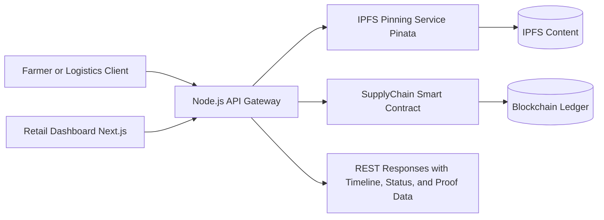

# IndiaNext Web

IndiaNext Web is a produce traceability platform that combines blockchain, decentralized storage, backend APIs, and a retailer dashboard to verify agricultural supply chain claims from farm to shelf.

## What This Project Does

- Creates harvest batches with a unique digital identity.
- Stores heavy evidence files (certificates, photos, metadata) on IPFS via Pinata.
- Records lightweight, tamper-resistant provenance events on-chain.
- Lets logistics checkpoints be appended as immutable transit history.
- Lets retailers verify and approve inbound produce from a web dashboard.
- Supports graceful mock mode when blockchain or IPFS credentials are not configured.

## Tech Stack

- Smart contract: Solidity + Hardhat
- Backend API: Node.js + Express + ethers
- Decentralized storage: IPFS (Pinata)
- Frontend dashboard: Next.js + React + Tailwind CSS
- Network target: Polygon-compatible RPC endpoint

## System Architecture

## Core Features

### 1) Blockchain and Decentralized Storage

- Immutable state transitions for each batch lifecycle stage.
- Role-based access control for Admin, Farmer, Logistics, and Retailer actions.
- Gas-aware design: transit history emitted as events and reconstructed off-chain.
- IPFS CIDs are referenced in contract-linked data instead of storing heavy files on-chain.

### 2) Backend API Gateway

- Translates HTTP calls into blockchain transactions using ethers.
- Pins files and JSON metadata to IPFS.
- Provides role-management endpoint for wallet RBAC assignment.
- Supports mock-mode fallback for local development without full infrastructure.

### 3) Retail Web Dashboard

- Lists incoming produce batches and verification stats.
- Loads provenance journey for each batch.
- Approves verified batches.
- Displays real-time API-backed status with chain-aware fallback behavior.

## Smart Contract Model

Contract: SupplyChain.sol

### Batch States

- Harvested
- InTransit
- AtRetail
- Sold

### Roles

- Admin
- Farmer
- Logistics
- Retailer

### Key On-Chain Actions

- grantRole
- createBatch
- updateTransit
- receiveAtRetail
- markSold
- getBatch

## API Reference

Base URL:

- http://localhost:5000

### Health

- GET /
	- Returns service status, version, blockchain mode, and IPFS mode.

### Produce

- GET /api/produce/all
	- List incoming batches and stats.

- POST /api/produce/add
	- Create new harvest batch.
	- Body example: batchName, origin, crop, quantity, unit, farmerName, ipfsCID

- GET /api/produce/trace/:id
	- Get full batch provenance timeline.

- POST /api/produce/approve
	- Approve batch at retail.
	- Body example: batchId

- POST /api/produce/transfer
	- Log ownership or location checkpoint update.
	- Body example: batchId, newOwner, newLocation, notes, gpsLat, gpsLong

### Roles

- POST /api/roles/grant
	- Grant role to wallet.
	- Body example: address, role (Farmer, Logistics, Retailer)

### Uploads

- POST /api/upload/certificate
	- Multipart file upload for certificates.

- POST /api/upload/photo
	- Multipart file upload for harvest or transit photos.

- POST /api/upload/metadata
	- Pin JSON metadata to IPFS.
	- Body example: metadata, name

## Local Setup

### 1) Install dependencies

From project root:

- npm install

From client folder:

- cd client
- npm install

### 2) Configure environment variables

Create a .env file in the project root with values similar to:

- PORT=5000
- POLYGON_RPC_URL=your_rpc_url
- DEPLOYER_PRIVATE_KEY=your_private_key
- CONTRACT_ADDRESS=your_deployed_contract_address
- PINATA_JWT=your_pinata_jwt
- PINATA_GATEWAY_URL=https://gateway.pinata.cloud/ipfs

For frontend, set:

- NEXT_PUBLIC_API_URL=http://localhost:5000

### 3) Run backend

From project root:

- node server.js

### 4) Run frontend

From client folder:

- npm run dev

Frontend default URL:

- http://localhost:3000

## Hardhat and Contract Workflow

Useful commands from project root:

- npx hardhat compile
- npx hardhat test
- npx hardhat run scripts/deploy.js --network yourNetwork

After deployment, update CONTRACT_ADDRESS in .env.

## Current Status and Scope

Implemented in this repository:

- Smart contract and deployment/testing scaffold
- API gateway with Web3 and IPFS services
- Retail dashboard in Next.js
- Mock fallback paths for dev without live infra

Planned and aligned with architecture, but not yet present in this repository:

- Native Kotlin mobile app for farmers and logistics
- Offline-first local caching and sync queue
- Integrated QR scanner and direct camera capture flow
- Geolocation tagging for checkpoint logging
- Consumer-facing final QR destination page

## End-to-End Workflow

### Step 1: Origin (Farmer)

- Farmer creates a harvest batch with crop and origin details.
- Certificate/photo is uploaded and pinned to IPFS.
- Backend records batch creation data with IPFS CID reference.

### Step 2: Transit (Logistics)

- Logistics operator scans or selects the batch and logs checkpoints.
- Each checkpoint can include location and GPS values.
- Backend writes transit updates to on-chain event history.

### Step 3: Retail Verification

- Retail manager opens dashboard and traces batch journey.
- Manager verifies provenance and approves intake.
- Batch lifecycle progresses to retail state.

### Step 4: Consumer Transparency

- Provenance data can be surfaced via QR-linked web view for shoppers.
- Timeline is backed by cryptographic chain data plus IPFS evidence.

## Suggested Next Milestones

- Add persistent database for off-chain catalog and analytics.
- Add authentication and request signing for API access.
- Add background job queue for resilient transaction submission.
- Add QR generation and dedicated public trace page in Next.js.
- Build Kotlin mobile app module for field operations.

## License

ISC
